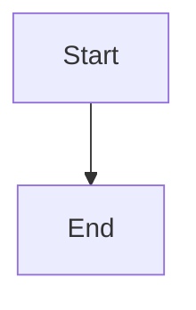

# Architecture Diagrams

Comprehensive visual documentation for the Microsoft Fabric CI/CD solution in **Mermaid.js** format (text-based, version-control friendly).

## 📁 Diagram Inventory

All diagrams are numbered 1-19 in Mermaid.js format:

### Core System Diagrams (1-7)

| # | Diagram Name | File | Purpose |
|---|--------------|------|---------|
| 1 | **System Architecture** | `1_system_architecture.mermaid` | Overall component architecture with v2.0 features |
| 2 | **User Story 1 Flow** | `2_user_story_1_flow.mermaid` | 9-second workspace creation workflow with Git integration |
| 3 | **Deployment Pipeline** | `3_deployment_pipeline.mermaid` | Layered architecture with GitHub Actions CI/CD (operational) |
| 4 | **Data Flow** | `4_data_flow.mermaid` | Data movement through system layers with v2.0 processing |
| 5 | **Component Layers** | `5_component_layers.mermaid` | Technical stack from presentation to infrastructure with hardening layer |
| 6 | **Sequence Diagram** | `6_sequence_diagram.mermaid` | API call sequences and interactions |
| 7 | **Entity Relationship** | `7_entity_relationship.mermaid` | Workspace structure and data relationships |

### Production Hardening Architecture Diagrams (8-19)

| # | Diagram Name | File | Purpose |
|---|--------------|------|---------|
| 8 | **Production Hardening: Architecture Comparison** | `8_production_hardening_architecture_comparison.mermaid` | Current baseline vs target production-ready architecture |
| 9 | **Secret Management Flow** | `9_secret_management_flow.mermaid` | Azure Key Vault integration with caching and fallback |
| 10 | **Authentication Flow** | `10_authentication_flow.mermaid` | Token lifecycle with refresh and error handling |
| 11 | **Retry Logic with Circuit Breaker** | `11_retry_circuit_breaker.mermaid` | State machine for resilience patterns |
| 12 | **Transaction Rollback Flow** | `12_transaction_rollback.mermaid` | Rollback mechanisms for CUD operations |
| 13 | **Telemetry Data Flow** | `13_telemetry_flow.mermaid` | Structured logging and App Insights integration |
| 14 | **Test Pyramid** | `14_test_pyramid.mermaid` | Testing strategy across unit/integration/E2E layers |
| 15 | **Migration Timeline** | `15_migration_timeline.mermaid` | 12-week phased implementation plan (Gantt chart) |
| 16 | **Environment Strategy** | `16_environment_strategy.mermaid` | Local/Dev/Staging/Production environment configurations |
| 17 | **Monitoring Metrics Dashboard** | `17_monitoring_metrics.mermaid` | Performance, reliability, security, and business metrics |
| 18 | **Success Criteria Matrix** | `18_success_criteria.mermaid` | Comprehensive criteria across security, reliability, ops excellence |
| 19 | **Complete System Architecture** | `19_complete_system_architecture.mermaid` | Full production-hardened architecture with all layers |

---

## 🎨 Mermaid.js Format

### Why Mermaid.js?
**Advantages:**
- ✅ Version control friendly (plain text, easy diffs)
- ✅ GitHub/GitLab native rendering
- ✅ VS Code preview support
- ✅ Documentation site integration (reveal.js, MkDocs, etc.)
- ✅ Automated diagram generation in CI/CD
- ✅ Small file size (1-3 KB per diagram)
- ✅ Easy programmatic updates

### How to Use

**In Markdown files:**
```markdown

```

**Preview in VS Code:**
1. Install "Markdown Preview Mermaid Support" extension
2. Open `.mermaid` file
3. Press `Ctrl+Shift+V` (Windows/Linux) or `Cmd+Shift+V` (Mac)

**Preview in reveal.js:**
```html
<section>
    <pre><code class="mermaid">
    graph TD
        A[Start] --> B[End]
    </code></pre>
</section>
```

---

## 📊 Diagram Details

### Core System Diagrams (1-7)

#### 1. System Architecture
**Shows:** Overall component relationships and interactions  
**Key elements:**
- User Interface Layer (CLI with 9-second execution, future Web UI)
- Core Engine Layer (orchestration, audit logging)
- **v2.0 Utilities Layer ✅ PRODUCTION** (Git connector, naming validator, audit logger, item/workspace managers)
- API Integration Layer (Fabric API, Git API, Azure AD, Registry)
- **Production Hardening Layer 🔧 OPTIONAL** (retry handler, circuit breaker, rollback, telemetry, health checks)
- External Services (Microsoft Fabric, GitHub/Azure DevOps, App Insights, Key Vault)
- Output Layer (Workspace, Git repo, folders, logs, registry)

**Status indicators:**
- ✅ Production (green) - v2.0 features operational
- 🔧 Optional (orange) - Production hardening utilities available
- 🎯 Future (dashed red) - Planned enhancements

---

#### 2. User Story 1 Flow
**Shows:** 3-step workspace creation workflow with v2.0 features  
**Phases:**
1. **Define** - YAML descriptor with git_integration and naming_validation flags
2. **Execute** - 7-phase processing (Validate → Auth → Create → **Git Link** → Scaffold → Register → Log)
3. **Results** - Outputs in Fabric Cloud, Git Repository (with feature branch), Audit, Registry

**v2.0 Features Highlighted:**
- ✅ Automated Git Integration (fabric_git_connector.py)
- ✅ Naming Validation (item_naming_validator.py with medallion architecture)
- ✅ Enhanced Audit Trail (audit_trail.jsonl with 10+ event types)

**Real data:**
- Workspace: "Customer Analytics DEV"
- Execution time: 9 seconds ⚡
- Capacity: FTL64 (Trial)
- Date: Oct 27, 2025

---

#### 3. Deployment Pipeline
**Shows:** Layered architecture with operational CI/CD  
**Architecture Layers:**
1. **Input Layer** - YAML, config, principals files
2. **CLI Layer** - onboard_data_product.py (Primary deployment - 9 seconds)
3. **Utilities Layer** - v2.0 features (Git connector, naming validator, audit logger)
4. **API Integration Layer** - Fabric REST API, Git providers, Azure AD
5. **Production Hardening Layer** - Optional utilities (retry, circuit breaker, rollback, telemetry, health, secret manager, feature flags)
6. **Output Layer** - Workspace, Git repo, audit logs, registry

**GitHub Actions CI/CD ✅ OPERATIONAL:**
- CI Pipeline: Lint, 89 unit tests, 6 integration tests, 6 E2E tests, security scan, 85%+ coverage
- CD Pipeline: deploy.yml, manual approval, environment selection, post-deploy validation

**Two Deployment Workflows:**
1. Direct CLI execution (9 seconds)
2. Automated GitHub Actions workflow

---

#### 4. Data Flow
**Shows:** Data movement through 6 layers with v2.0 enhancements  
**Layers:**
1. **Data Sources** - User input (YAML, project.config.json, principals files), future raw data/APIs
2. **Ingestion Layer** - YAML parser, Azure AD OAuth 2 auth, configuration management
3. **Processing Layer - v2.0 ✅** - item_naming_validator.py, naming conventions, audit context, Git linkage
4. **API Integration Layer** - Fabric REST API, fabric_git_connector.py, audit_logger.py (JSONL, 10+ events)
5. **Storage Layer** - Fabric Cloud (Git linked), Local Git repo, audit_trail.jsonl, .workspace_registry.json
6. **Output Layer** - Workspace (users configured, Git synced), folders, JSONL logs, registry entry, Git branch

**v2.0 Features:**
- Medallion architecture validation
- Sequential numbering and ticket-based naming
- Bidirectional Git sync
- Enhanced JSONL audit trail
- Monitoring with 9-second execution tracking

---

#### 5. Component Layers
**Shows:** Technical stack from top to bottom with v2.0 and hardening details  
**Layers:**
1. **Presentation Layer** - CLI (9-second execution), Web UI Dashboard (future)
2. **Application Layer** - Core orchestrator, validators/parsers, template engine
3. **Business Logic Layer - v2.0 ✅ PRODUCTION** - Workspace manager, item manager, Git connector (fabric_git_connector.py), naming validator (item_naming_validator.py), audit logger (audit_logger.py), registry manager
4. **Production Hardening Layer 🔧 OPTIONAL** - Retry handler, circuit breaker, transaction rollback, telemetry, health checks, secret manager, feature flags
5. **Integration Layer** - Fabric API client, Git client (GitPython), config manager
6. **Data Layer** - Local cache, .workspace_registry.json, audit_trail.jsonl (10+ event types)
7. **External Services** - Microsoft Fabric APIs, Git remote (GitHub/Azure DevOps), Azure AD authentication, App Insights (optional), Azure Key Vault (optional)
8. **Infrastructure Layer** - Network (HTTPS TLS), logging framework, monitoring
9. **GitHub Actions CI/CD ✅ OPERATIONAL** - CI pipeline (89 unit, 6 integration, 6 E2E tests, 85% coverage), CD pipeline (deploy.yml, manual approval)

**Technologies:**
- Python 3.10, 3.11, 3.12 (matrix testing)
- GitPython, Jinja2, Rich console
- Pydantic models, OAuth 2 authentication

---

#### 6. Sequence Diagram
**Shows:** API call sequences and timing  
**Actors:**
- User, CLI, Parser, Validator, Auth, Fabric API, Git, Registry, Audit

**Flow:**
1. User executes command
2. CLI loads and parses YAML
3. Validator checks schema
4. Auth retrieves token (OAuth 2.0)
5. Fabric API creates workspace (3s)
6. Local scaffolding + Git branch (2s)
7. Registry + Audit logging (4s)
8. Success message (total: 9.23s)

**Features:**
- Detailed activation boxes
- Error handling branches
- Phase timing breakdowns
- Real production data

---

#### 7. Entity Relationship
**Shows:** Workspace structure and data relationships  
**Entities:**
- **Core:** Workspace, Capacity, Lakehouse, Folder, File
- **Content:** Notebook, Dataflow, Dataset, Report
- **Tracking:** Registry Entry, Audit Log, Git Branch, Commit, File Change

**Relationships:**
- Workspace ↔ Capacity (one-to-one)
- Workspace → Lakehouse/Notebook/Report (one-to-many)
- Lakehouse → Folder → File (nested hierarchy)
- Workspace → Git Branch → Commit → File Change (version control)
- Workspace → Registry Entry + Audit Log (tracking)

**Key attributes:**
- Primary Keys (PK), Foreign Keys (FK), Unique Keys (UK)
- Timestamps, status fields, metadata
- Real file paths and identifiers

---

### Production Hardening Architecture Diagrams (8-19)

#### 8. Production Hardening: Architecture Comparison
**Shows:** Side-by-side comparison of current baseline vs target production-ready architecture  
**Current Architecture (4 layers):**
- Presentation (CLI, Scripts)
- Core Logic (Workspace/Item management, Git connector, Audit)
- Integration (Fabric/Git/Azure APIs)
- Data (Cache, Registry, Logs)

**Target Architecture (6 layers):**
- All current layers PLUS:
- Secret Management (Azure Key Vault with feature flags)
- Resilience Layer (Retry, Circuit Breaker, Timeout, Rollback)
- Enhanced Observability (App Insights, Structured Logging, Custom Metrics)

**Migration path:** 7 phases over 12 weeks

---

#### 9. Secret Management Flow
**Shows:** Azure Key Vault integration with graceful degradation  
**Flow:**
1. Application requests secret
2. Feature flag check (USE_KEY_VAULT)
3. If enabled: Check cache (TTL=1hr) → Fetch from Key Vault with retry → Cache result
4. If disabled: Load from .env
5. On Key Vault failure: Fallback to .env (graceful degradation)

**Features:**
- Caching with 1-hour TTL
- Exponential backoff retry
- Graceful degradation to .env
- Feature flag control

---

#### 10. Authentication Flow
**Shows:** Complete token lifecycle with refresh logic  
**Sequence:**
1. User executes command
2. AuthManager checks token cache
3. If expired: Authenticate with Azure AD (device code/interactive)
4. Store encrypted tokens (access + refresh)
5. API request with Bearer token
6. On 401: Refresh token automatically and retry
7. Return command result

**Features:**
- Token caching with expiry check
- Automatic refresh on 401
- Encrypted storage
- Retry on token refresh

---

#### 11. Retry Logic with Circuit Breaker
**Shows:** State machine for resilience patterns  
**States:**
- **Closed:** Normal operation, tracking failures
- **Attempting:** Executing request
- **RetryDelay:** Exponential backoff (1s → 2s → 4s → 8s → 16s)
- **Open:** Circuit breaker triggered, fast fail mode (cooldown: 30s)
- **Half-Open:** Testing recovery with limited requests
- **Success/Failed:** Terminal states

**Features:**
- Exponential backoff with jitter (±20%)
- Max 5 retries
- Circuit breaker on max retries
- 30-second cooldown before testing recovery

---

#### 12. Transaction Rollback Flow
**Shows:** Rollback mechanisms for Create/Update/Delete operations  
**Flow:**
1. Start transaction with logging
2. Validate inputs (early exit if invalid)
3. Execute primary operation
4. On failure: Rollback based on operation type
   - Create: Delete created resource
   - Update: Restore from snapshot
   - Delete: Recreate from backup
5. Verify rollback success
6. Log outcome (success or manual intervention required)

**Features:**
- Transaction ID tracking
- State snapshots before mutations
- Operation-specific rollback logic
- Verification after rollback

---

#### 13. Telemetry Data Flow
**Shows:** Structured logging and App Insights integration  
**Flow:**
1. Application code generates logs
2. LOG_LEVEL filtering
3. Structured logger routes to:
   - Console handler (development, colored)
   - File handler (rotating 10MB chunks)
   - App Insights handler (production)
4. App Insights → Kusto queries → Dashboards/Alerts/Metrics
5. Visualization in Grafana

**Telemetry types:**
- Traces (execution flow)
- Metrics (performance counters)
- Dependencies (external API calls)
- Exceptions (error details with stack traces)

---

#### 14. Test Pyramid
**Shows:** Testing strategy across three layers  
**Unit Tests (Most):**
- Core logic, utility functions, data models, error handling, configuration, mocks, retry logic

**Integration Tests (More):**
- API integration, auth flow, secret management, database, external dependencies (PowerBI, Purview)

**E2E Tests (Few):**
- Full system tests with real Azure resources
- User journey tests (complete workflows)
- Smoke tests (production validation)

**Coverage target:** >80% unit test coverage

---

#### 15. Migration Timeline
**Shows:** 12-week phased implementation plan (Gantt chart)  
**Phases:**
1. **Foundation (Weeks 1-2):** Secret management, Key Vault, feature flags
2. **Authentication (Weeks 3-4):** Token caching, refresh logic, error handling
3. **Reliability (Weeks 5-6):** Retry logic, circuit breaker, timeouts
4. **Transaction Safety (Weeks 7-8):** Transaction IDs, rollback, state snapshots
5. **Observability (Weeks 9-10):** Structured logging, App Insights, metrics/alerts
6. **Testing (Weeks 11-12):** Unit/integration/E2E test expansion
7. **Deployment (Week 12):** CI/CD updates, staging testing, production rollout, post-deployment monitoring

**Milestones:** Production rollout at end of Week 12

---

#### 16. Environment Strategy
**Shows:** Configuration across Local/Dev/Staging/Production environments  
**Local Development:**
- .env for secrets, mock external services, unit tests only, fast feedback

**Development Environment:**
- Azure Key Vault (dev-kv), Fabric Workspace (dev-ws), App Insights (dev-ai)
- Integration tests enabled, all feature flags ON

**Staging Environment:**
- Azure Key Vault (staging-kv), Fabric Workspace (staging-ws), App Insights (staging-ai)
- E2E tests enabled, 95% production parity, blue-green deployment

**Production Environment:**
- High availability Key Vault, Business Critical Fabric Workspace, Advanced App Insights
- Circuit breakers active, 24/7 monitoring/alerts, DR with RPO <1hr, gradual feature flag rollout

---

#### 17. Monitoring Metrics Dashboard
**Shows:** Comprehensive metrics across 5 categories  
**Performance Metrics:**
- API response time (target: p95 <2s)
- Success rate (target: >99.5%)
- Error rate (target: <0.5%)
- Throughput (requests/min)

**Reliability Metrics:**
- Circuit breaker state (Open/Closed/Half-Open)
- Retry count per request type
- Token refresh rate per hour
- Cache hit rate (target: >80%)

**Security Metrics:**
- Authentication failures (alert: >5/min)
- Key Vault access latency & success
- Secret rotation age (alert: >90 days)
- Failed authorization attempts

**Business Metrics:**
- Workspace operations (Create/Update/Delete)
- User management actions (Add/Remove)
- Deployment success rate by environment
- Rollback frequency (target: <2%)

**System Health:**
- Memory usage (alert: >80%)
- CPU usage (alert: >70%)
- Disk I/O (log rotation)
- Network latency (Azure services)

**Notification Hub:** Email, Teams, PagerDuty

---

#### 18. Success Criteria Matrix
**Shows:** Comprehensive criteria across 5 dimensions (Mindmap)  
**Security:**
- Azure Key Vault integration, authentication hardening, access control (RBAC, audit logging)

**Reliability:**
- Retry logic (exponential backoff, max 5 retries, jitter)
- Circuit breaker (failure threshold, cooldown)
- Timeout management (30s default, 5min max)

**Operational Excellence:**
- Transaction safety (ID tracking, rollback, snapshots)
- Observability (structured logging, App Insights, metrics/alerts)
- Testing (>80% unit coverage, integration/E2E tests)

**Performance:**
- Response times (API p95 <2s, auth <500ms)
- Resource efficiency (memory <512MB, connection pooling)
- Scalability (100+ concurrent operations, 10K+ calls/day)

**Maintainability:**
- Code quality (type hints, docstrings, linting)
- Documentation (architecture diagrams, API reference, troubleshooting)
- Developer experience (enhanced CLI with 37+ commands, comprehensive testing, clear error messages)

---

#### 19. Complete System Architecture
**Shows:** Full production-hardened architecture with all layers  
**Layers:**
1. **Presentation:** Enhanced Fabric CLI (37+ commands), Python scripts (14 core modules)
2. **Orchestration:** Auth Manager, Config Manager, Secret Manager, Structured Logger
3. **Business Logic:** Workspace management, Fabric items, Deployment, Data quality, Git integration, Data contracts
4. **Resilience:** Retry handler, Circuit breaker, Timeout manager, Rollback engine
5. **Integration:** Fabric/PowerBI/Purview REST APIs, Azure Key Vault, App Insights
6. **Data:** Token cache (encrypted), State store (transaction snapshots), Log files (rotating 10MB)

**Key flows:**
- CLI → Auth → Secret Manager → Key Vault
- Business logic → Retry → Circuit Breaker → Timeout → Rollback → APIs
- Logger → App Insights (telemetry, metrics, traces, exceptions)
- Auth → Token cache (encrypted storage)

**Color coding:** Presentation (cyan), Auth (orange), Secrets (green), Resilience (purple/red/yellow), APIs (blue), Storage (green/orange)

---

## 🚀 Quick Start

### For Documentation
```bash
# Copy diagram to markdown file
cat 1_system_architecture.mermaid

# Paste in fenced code block:
```mermaid
[paste content here]
```

# GitHub/GitLab will render automatically
```

### For VS Code Preview
```bash
# Install Mermaid extension
code --install-extension bierner.markdown-mermaid

# Preview diagram
# Right-click .mermaid file → "Open Preview"
# Or press Ctrl+Shift+V (Windows/Linux) or Cmd+Shift+V (Mac)
```

### For Presentations
```bash
# Export to PNG/SVG using Mermaid CLI
npm install -g @mermaid-js/mermaid-cli
mmdc -i 1_system_architecture.mermaid -o output.png

# Or use mermaid.live online editor
# Visit https://mermaid.live, paste code, export
```

---

## 🎯 Use Cases

| Scenario | Approach | Diagram(s) |
|----------|----------|------------|
| **Executive presentation** | Mermaid → PNG export → slides | 1, 2, 3, 8, 15 |
| **Technical documentation** | Mermaid in Markdown | All 19 |
| **GitHub README** | Mermaid (native rendering) | 1, 2, 3, 4, 8, 19 |
| **Architecture review** | Mermaid with annotations | 1, 3, 5, 7, 8, 19 |
| **Stakeholder demo** | Mermaid in reveal.js | 2, 3, 6, 8, 15 |
| **Developer onboarding** | Mermaid in docs | 5, 6, 7, 10, 11, 12, 13 |
| **CI/CD pipeline docs** | Mermaid in Markdown | 3, 6, 15 |
| **Data modeling** | Mermaid ER diagram | 7 |
| **v2.0 feature showcase** | Mermaid with status indicators | 1, 2, 4, 5 |
| **Production hardening planning** | Mermaid with timelines/flows | 8, 9, 10, 11, 12, 15, 16 |
| **Security review** | Mermaid flow diagrams | 9, 10, 18 |
| **Monitoring setup** | Mermaid metrics dashboard | 13, 17, 18 |
| **Testing strategy** | Mermaid test pyramid | 14, 18 |
| **Environment configuration** | Mermaid environment strategy | 16, 19 |

---

## 📦 Export & Integration

### Export Mermaid to PNG/SVG
**Option 1: Mermaid CLI**
```bash
npm install -g @mermaid-js/mermaid-cli
mmdc -i 1_system_architecture.mermaid -o output.png
mmdc -i 1_system_architecture.mermaid -o output.svg
```

**Option 2: Online**
1. Visit [mermaid.live](https://mermaid.live)
2. Paste diagram code
3. Click "Export PNG" or "Export SVG"

### Integrate into reveal.js Presentation
```html
<section>
    <h2>System Architecture</h2>
    <pre><code class="mermaid">
        <!-- Paste mermaid code here -->
    </code></pre>
</section>

<!-- Add to <head> -->
<script type="module">
    import mermaid from 'https://cdn.jsdelivr.net/npm/mermaid@10/dist/mermaid.esm.min.mjs';
    mermaid.initialize({ startOnLoad: true });
</script>
```

**Alternative: Export as image first**
```html
<section>
    <h2>System Architecture</h2>
    
</section>
```

---

## 🔄 Updating Diagrams

### Edit Mermaid Files
```bash
# Edit .mermaid file directly (plain text)
nano 1_system_architecture.mermaid

# Or use VS Code
code 1_system_architecture.mermaid

# Preview changes with Mermaid extension
# Right-click → "Open Preview" or Ctrl+Shift+V
```

### Best Practices
- Avoid parentheses `()` in node labels (use "or" or spell out)
- Avoid forward slashes `/` (use commas or "or")
- Avoid ampersands `&` (use "and")
- Avoid plus signs `+` (spell out "plus")
- Use status indicators: ✅ Production, 🔧 Optional, 🎯 Future

---

## 🎨 Color Schemes & Status Indicators

All diagrams use consistent Microsoft color palette:

| Color | Hex Code | Usage |
|-------|----------|-------|
| **Green** | `#107C10` | ✅ Production features, operational components |
| **Azure Blue** | `#0078D4` | v2.0 features, UI elements, CI/CD pipelines |
| **Orange** | `#FF8C00` | 🔧 Optional hardening utilities, application layer |
| **Purple** | `#9C27B0` | Integration layer, storage, external services |
| **Yellow** | `#F57F17` | Data layer, monitoring, registry |
| **Teal** | `#00796B` | Infrastructure, low-level components |
| **Gray** | `#666666` | External systems, third-party services |
| **Red (dashed)** | `#C62828` | 🎯 Future planned features |

**Status Indicators:**
- ✅ **PRODUCTION** - Operational and validated (green)
- 🔧 **OPTIONAL** - Available hardening utilities (orange)
- 🎯 **FUTURE** - Planned enhancements (red dashed)

---

## 📚 References

### Official Documentation
- **Mermaid.js:** [mermaid.js.org](https://mermaid.js.org)
- **Mermaid Live Editor:** [mermaid.live](https://mermaid.live)
- **reveal.js:** [revealjs.com](https://revealjs.com)

### Extensions
- **VS Code Mermaid:** [marketplace.visualstudio.com](https://marketplace.visualstudio.com/items?itemName=bierner.markdown-mermaid)

### Syntax Guides
- **Mermaid Flowcharts:** [mermaid.js.org/syntax/flowchart.html](https://mermaid.js.org/syntax/flowchart.html)
- **Mermaid ER Diagrams:** [mermaid.js.org/syntax/entityRelationshipDiagram.html](https://mermaid.js.org/syntax/entityRelationshipDiagram.html)
- **Mermaid Sequence:** [mermaid.js.org/syntax/sequenceDiagram.html](https://mermaid.js.org/syntax/sequenceDiagram.html)

---

## ✅ Quality Checklist

All diagrams have been validated for:
- ✅ **Accuracy** - Reflects real production system (Oct 27 2025)
- ✅ **v2.0 Features** - Git connector, naming validator, audit logger accurately represented
- ✅ **Production Hardening** - 12 new diagrams covering security, reliability, observability, testing
- ✅ **Production Status** - Clear distinction between production, optional, and future features
- ✅ **Consistency** - Same color schemes, naming conventions across all diagrams
- ✅ **Completeness** - 19 diagram types in Mermaid format (7 core + 12 hardening)
- ✅ **Clarity** - Clear labels, status indicators, technical details
- ✅ **Evidence-based** - Real component names, validated metrics (9-second execution, 103 tests)
- ✅ **Syntax Validated** - All Mermaid diagrams render without errors

---

## 🤝 Contribution Guidelines

When updating diagrams:
1. **Maintain consistency** - Use existing color schemes and styles
2. **Add status indicators** - ✅ Production, 🔧 Optional, 🎯 Future
3. **Use real data** - Reference actual component names, workspace IDs, dates, metrics
4. **Follow syntax rules** - Avoid `()`, `/`, `&`, `+` in node labels
5. **Test rendering** - Preview in VS Code or mermaid.live before committing
6. **Document changes** - Update this README with new features/sections
7. **Include technical details** - File names (e.g., fabric_git_connector.py), metrics (9 seconds, 103 tests)

---

## 📞 Support

For questions or issues with diagrams:
1. Check diagram-specific comments in `.mermaid` files
2. Review Excalidraw element IDs for structure understanding
3. Consult project documentation in `../docs/`
4. Reference User Story 1 for production validation

---

## 📝 Version History

**v3.0 - January 2025:**
- Added 12 Production Hardening Architecture diagrams (8-19)
- Secret management flow with Azure Key Vault integration
- Authentication flow with token refresh logic
- Retry logic with circuit breaker state machine
- Transaction rollback mechanisms
- Telemetry and monitoring flows
- Test pyramid and migration timeline
- Environment strategy and success criteria
- Complete system architecture with all layers
- Updated use cases and quality checklist
- Enhanced documentation with detailed descriptions

**v2.0 - October 27, 2025:**
- Updated all diagrams to reflect v2.0 production features
- Added Git connector (fabric_git_connector.py) details
- Added naming validator (item_naming_validator.py) with medallion architecture
- Added audit logger (audit_logger.py) with JSONL format
- Updated deployment pipeline to show layered architecture
- Added GitHub Actions CI/CD as operational (not planned)
- Clarified production hardening utilities as optional (not "not integrated")
- Removed Excalidraw files (focusing on Mermaid for version control)
- Fixed Mermaid syntax issues (parentheses, slashes, special characters)

---

**Last Updated:** January 2025  
**Status:** 19/19 diagrams complete and syntax validated  
**Format:** Mermaid.js  
**Total Files:** 19 diagram files + 1 README  
**Production Features:** v2.0 (Git integration, naming validation, audit logging) + Production Hardening Architecture (12 diagrams)  
**Test Coverage:** 103 tests (89 unit, 6 integration, 6 E2E, 2 real Fabric)
