# Production Hardening Architecture - Mermaid Diagrams

**Version:** 1.0  
**Date:** October 29, 2025  
**Source:** [PRODUCTION_HARDENING_ARCHITECTURE.md](PRODUCTION_HARDENING_ARCHITECTURE.md)

---

## 📐 1. Current vs Target Architecture Overview

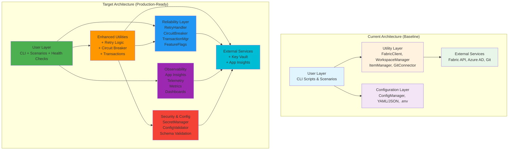

---

## 🔐 2. Secret Management Flow

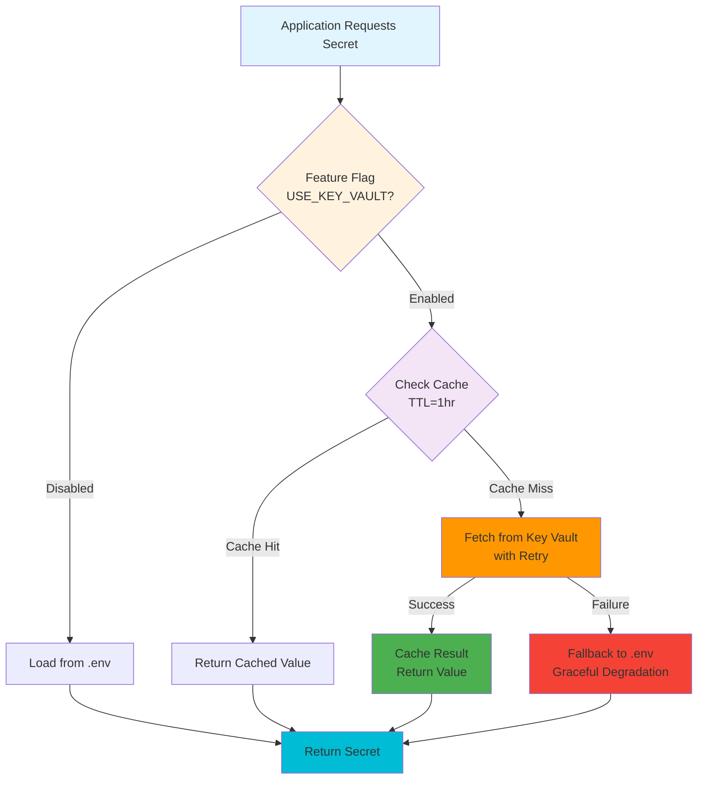

---

## 🔄 3. Authentication Flow

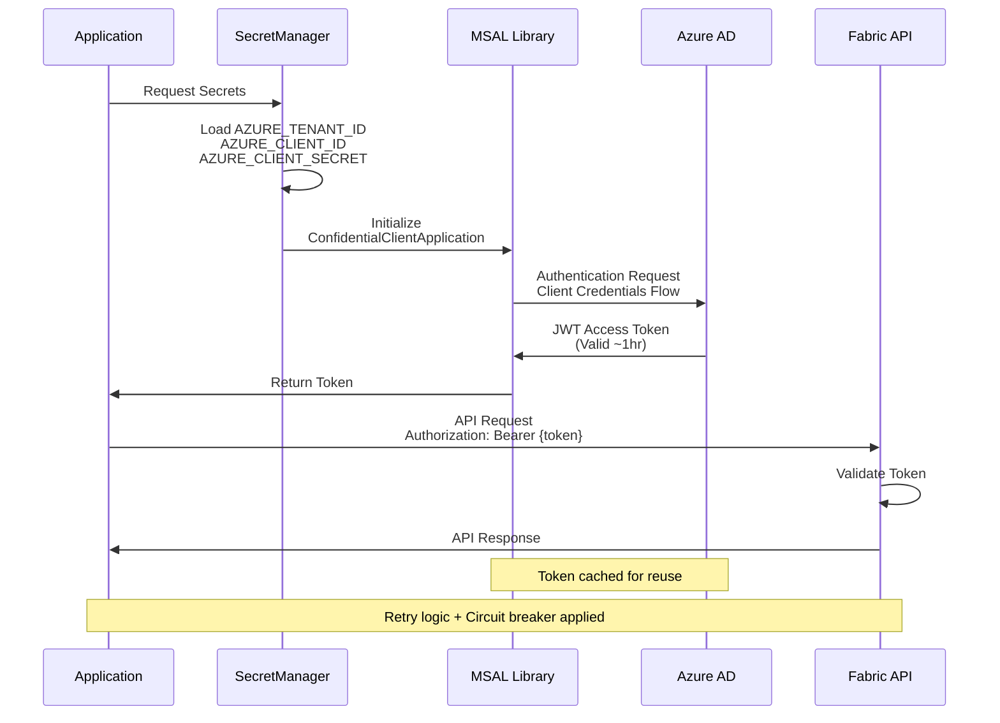

---

## 🔄 4. Retry Logic with Circuit Breaker

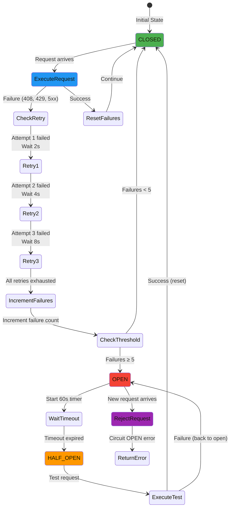

---

## 🔁 5. Transaction Rollback Flow

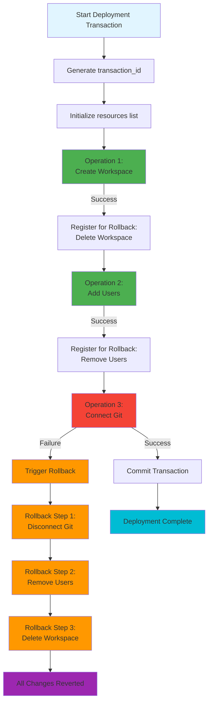

---

## 📊 6. Telemetry Data Flow

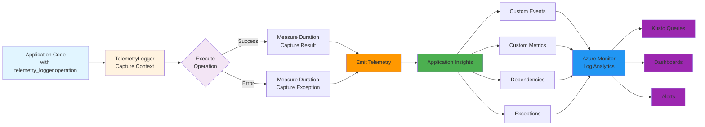

---

## 🧪 7. Test Pyramid

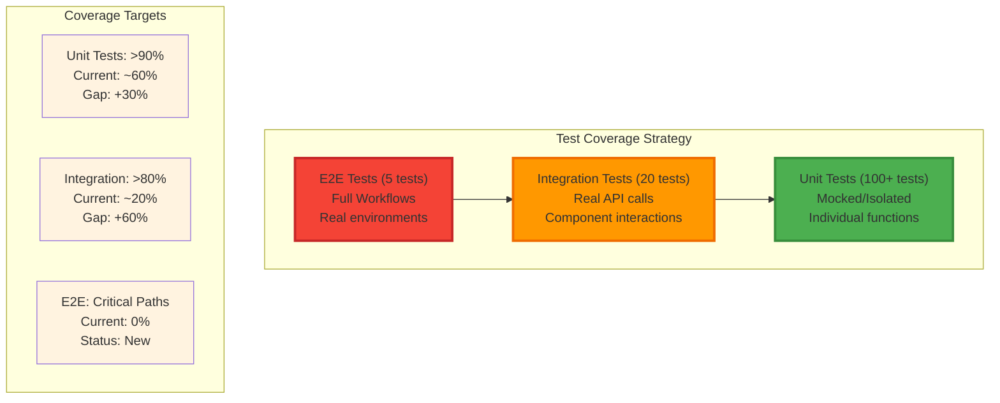

---

## 🔄 8. Migration Strategy Timeline

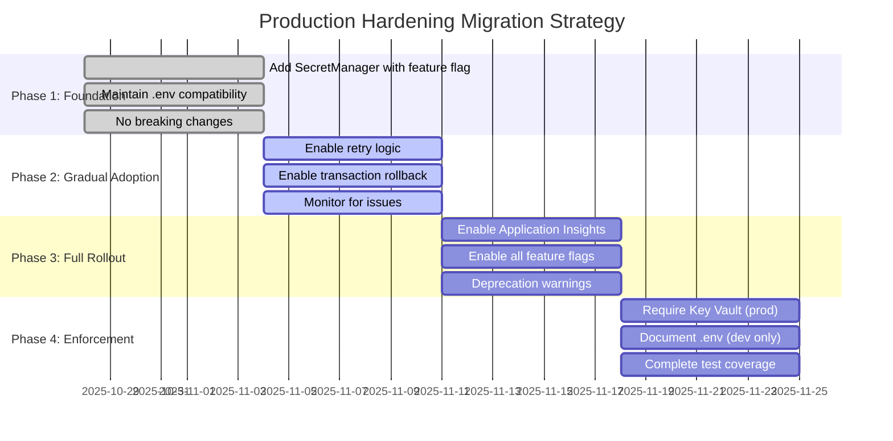

---

## 🌍 9. Environment Strategy

```mermaid
graph TB
    subgraph "Local Development"
        L1[.env for secrets<br/>No Key Vault required]
        L2[Feature flags: OFF by default]
        L3[Retry logic: ENABLED]
        L4[Transaction rollback: DISABLED]
        L5[Telemetry: DISABLED or local]
        
        L1 --> L2
        L2 --> L3
        L3 --> L4
        L4 --> L5
        
        style L1 fill:#e1f5ff
        style L2 fill:#e1f5ff
        style L3 fill:#e1f5ff
        style L4 fill:#e1f5ff
        style L5 fill:#e1f5ff
    end
    
    subgraph "Development (Azure)"
        D1[Key Vault: ENABLED]
        D2[Feature flags: ALL ON]
        D3[Telemetry: dev App Insights]
        D4[Transaction rollback: ENABLED]
        
        D1 --> D2
        D2 --> D3
        D3 --> D4
        
        style D1 fill:#fff3e0
        style D2 fill:#fff3e0
        style D3 fill:#fff3e0
        style D4 fill:#fff3e0
    end
    
    subgraph "Production (Azure)"
        P1[Key Vault: REQUIRED]
        P2[Feature flags: ALL ON<br/>Cannot disable]
        P3[Telemetry: prod App Insights]
        P4[Transaction rollback: REQUIRED]
        P5[Circuit breaker: Strict thresholds]
        P6[Health checks: MANDATORY]
        
        P1 --> P2
        P2 --> P3
        P3 --> P4
        P4 --> P5
        P5 --> P6
        
        style P1 fill:#c8e6c9
        style P2 fill:#c8e6c9
        style P3 fill:#c8e6c9
        style P4 fill:#c8e6c9
        style P5 fill:#c8e6c9
        style P6 fill:#c8e6c9
    end
    
    Local --> Development
    Development --> Production
```

---

## 📊 10. Monitoring Metrics Dashboard

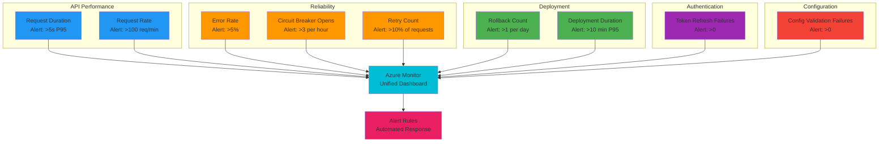

---

## 🎯 11. Success Criteria Matrix

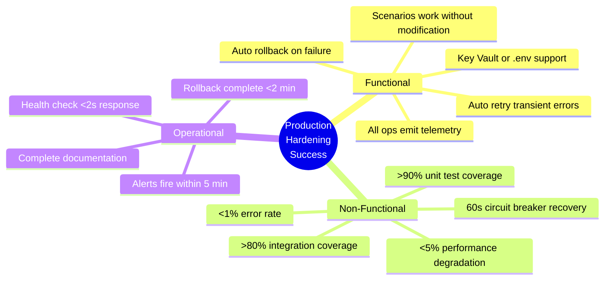

---

## 🔄 12. Complete System Architecture (Detailed)

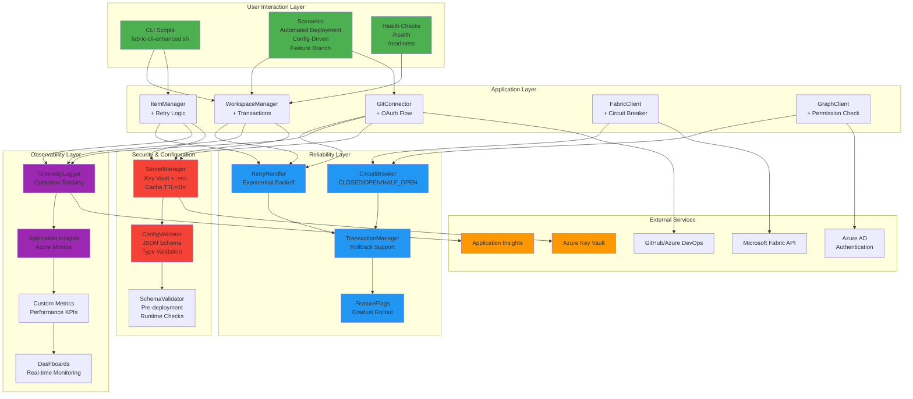

---

## 📝 Usage Instructions

### Rendering These Diagrams

**1. In GitHub/GitLab:**
- These diagrams will render automatically in Markdown preview
- Click on diagrams to see them in full size

**2. In VS Code:**
- Install extension: "Markdown Preview Mermaid Support"
- Open this file and click "Open Preview" (Ctrl+Shift+V)

**3. In Documentation Sites:**
- Most modern documentation tools (MkDocs, Docusaurus, etc.) support Mermaid
- Copy diagram code blocks directly

**4. As Images:**
- Use [Mermaid Live Editor](https://mermaid.live/) to export as PNG/SVG
- Copy diagram code and paste into editor

### Customization

Each diagram uses consistent color coding:
- 🔵 **Blue** (#2196f3) - Reliability/Retry components
- 🟠 **Orange** (#ff9800) - Processing/Transition states
- 🟢 **Green** (#4caf50) - Success states/User layer
- 🔴 **Red** (#f44336) - Error states/Security
- 🟣 **Purple** (#9c27b0) - Monitoring/Observability
- 🔷 **Cyan** (#00bcd4) - External services

---

**Document Owner:** GitHub Copilot  
**Source:** PRODUCTION_HARDENING_ARCHITECTURE.md  
**Generated:** October 29, 2025  
**Format:** Mermaid.js v10.x
