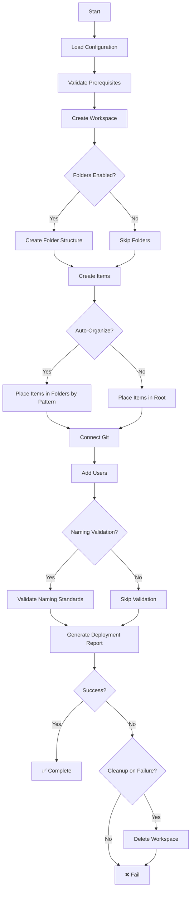

# Comprehensive Demo Scenario

**Full Feature Showcase with Intelligent Folder Organization**

[]()
[]()
[]()

---

## 📋 Overview

The **Comprehensive Demo Scenario** is the ultimate showcase of the USF Fabric CI/CD Framework capabilities. It demonstrates **ALL framework features** working together with intelligent folder organization, making it perfect for:

- 🎯 **Client Demonstrations** - Show the complete power of the framework
- 📚 **Learning & Training** - Understand all features in one place
- 🏗️ **Enterprise Templates** - Production-ready configuration patterns
- 🧪 **Feature Testing** - Validate framework capabilities end-to-end

### ✨ Features Demonstrated

<table>
<tr>
  <td>✅ <b>Folder Structure</b></td>
  <td>Medallion architecture with intelligent auto-organization</td>
</tr>
<tr>
  <td>✅ <b>Git Integration</b></td>
  <td>Auto-connect with directory structure and commit tracking</td>
</tr>
<tr>
  <td>✅ <b>Naming Validation</b></td>
  <td>Enforce standards with auto-fix and strict mode</td>
</tr>
<tr>
  <td>✅ <b>User Management</b></td>
  <td>Roles, service principals, and permission management</td>
</tr>
<tr>
  <td>✅ <b>Item Creation</b></td>
  <td>Lakehouses, notebooks, warehouses with folder placement</td>
</tr>
<tr>
  <td>✅ <b>Multi-Environment</b></td>
  <td>Dev/Test/Prod configurations</td>
</tr>
<tr>
  <td>✅ <b>Audit Logging</b></td>
  <td>Complete operation tracking and compliance</td>
</tr>
<tr>
  <td>✅ <b>Intelligent Organization</b></td>
  <td>Auto-place items by naming pattern rules</td>
</tr>
</table>

---

## 🚀 Quick Start

### Prerequisites

1. **Authentication configured** (`.env` file or environment variables)
2. **Trial capacity available** OR capacity ID configured
3. **Appropriate permissions** in Microsoft Fabric

### Run the Demo

```bash
# Navigate to scenario directory
cd scenarios/comprehensive-demo

# Dry run to preview (recommended first)
python run_comprehensive_demo.py --dry-run

# Deploy to development
python run_comprehensive_demo.py

# Deploy to production
python run_comprehensive_demo.py --environment prod --config comprehensive_demo_config.yaml
```

### Expected Output

```
================================================================================
  COMPREHENSIVE DEMO SCENARIO - Full Feature Showcase
================================================================================

Features:
  ✅ Folder Structure (Medallion Architecture)
  ✅ Git Integration (Auto-connect)
  ✅ Naming Validation (Enforce standards)
  ✅ User Management (Roles, service principals)
  ✅ Item Creation (Lakehouses, notebooks, warehouses)
  ✅ Multi-Environment Support
  ✅ Audit Logging
  ✅ Intelligent Item Organization

[Step 1/7] Creating Workspace
✓ Workspace created: 12345678-1234-1234-1234-123456789abc

[Step 2/7] Folder Structure Created - 15 folders
✓ Created 15 folders

[Step 3/7] Creating Items with Intelligent Folder Organization
ℹ Placing 'BRONZE_CustomerData_Lakehouse' in '🥉 Bronze Layer/Source Systems'
✓ Created lakehouse: BRONZE_CustomerData_Lakehouse
...
✓ Created 21 total items

[Step 4/7] Connecting to Git
✓ Git connection established

[Step 5/7] Adding Users
✓ Added 6/6 users

[Step 6/7] Validating Naming Standards
✓ All items pass naming validation

[Step 7/7] Validating Deployment
✓ Deployment validation complete

================================================================================
  DEPLOYMENT COMPLETE
================================================================================
✓ Workspace ID: 12345678-1234-1234-1234-123456789abc
✓ Folders Created: 15
✓ Items Created: 21
✓ Users Added: 6
✓ Git Connected: Yes
✓ Naming Valid: Yes

✅ Deployment successful!
```

---

## 📁 File Structure

```
comprehensive-demo/
├── README.md                              # This file
├── run_comprehensive_demo.py              # Main deployment script (900+ lines)
├── comprehensive_demo_config.yaml         # Full-featured config (440+ lines)
│
├── example_basic_medallion.yaml           # Simple medallion demo (~100 lines)
├── example_ml_lifecycle.yaml              # ML/Data science config (~180 lines)
├── example_multi_tenant.yaml              # Departmental multi-tenant (~280 lines)
│
└── [Generated at runtime]
    ├── deployment_report_*.json           # Deployment validation reports
    └── comprehensive_demo_deployment_*.json  # Audit logs
```

---

## ⚙️ Configuration Schema

### Extended YAML Structure

The comprehensive demo uses an **extended configuration schema** that builds on the standard `product_config.yaml` with additional folder intelligence:

```yaml
product:                    # Product metadata
  name: string
  description: string
  owner_email: string
  domain: string
  version: string
  tags: [string]

environments:               # Multi-environment support
  dev/test/prod:
    enabled: boolean
    capacity_type: trial|capacity
    capacity_id: string
    description: string
    auto_deploy: boolean
    folder_structure:
      enabled: boolean
      template: string

folder_structure:           # 🆕 NEW: Folder intelligence
  template: medallion|data-science|departmental|custom
  
  medallion:               # Medallion architecture definition
    layers: [...]
    shared_folders: [...]
  
  organization:            # 🆕 NEW: Auto-organization rules
    auto_organize: boolean
    organize_by: layer|type|lifecycle|custom
    rules:                 # Pattern-based folder routing
      - pattern: regex
        folder: path
        description: string
    unmatched_location: root|default_folder|prompt
    default_folder: string

git:                        # Git integration
  enabled: boolean
  organization: string
  repository: string
  branch: string
  directory: string
  auto_connect: boolean
  exclude_from_git: [string]
  commit_messages: {...}

workspace:                  # Workspace settings
  create_items: boolean
  validate_naming: boolean
  description_template: string
  permissions: {...}

items:                      # Items to create
  lakehouses: [...]
  notebooks: [...]
  warehouses: [...]
  # Each item can have folder_hint for explicit placement

users:                      # User management
  - email: string
    role: Admin|Member|Contributor|Viewer
    principal_type: User|ServicePrincipal
    reason: string

naming:                     # Naming validation
  validate: boolean
  auto_fix: boolean
  strict_mode: boolean
  rules: {...}
  auto_fix_rules: [...]

audit:                      # Audit logging
  enabled: boolean
  log_all_operations: boolean
  log_file: string
  track: [string]
  format: json|yaml|text

deployment:                 # Deployment settings
  wait_for_completion: boolean
  verify_items_created: boolean
  rollback_on_error: boolean
  retry: {...}
  validation: {...}
  cleanup_on_failure: boolean

features:                   # 🆕 NEW: Feature flags
  enable_folders: boolean
  enable_git: boolean
  enable_naming_validation: boolean
  enable_user_management: boolean
  enable_audit_logging: boolean
  enable_auto_organization: boolean

documentation:              # Documentation links
  architecture: string
  runbook: string
  naming_standards: string
  support: string
```

### Key Enhancements Over Standard Config

| Feature | Standard Config | Comprehensive Demo |
|---------|----------------|-------------------|
| Folder Structure | ❌ Not supported | ✅ Full support with templates |
| Auto-Organization | ❌ Not available | ✅ Pattern-based routing |
| Multi-Environment | ✅ Basic | ✅ Enhanced with folder settings |
| Feature Flags | ❌ Not available | ✅ Progressive rollout support |
| Documentation Links | ❌ Not available | ✅ Embedded documentation |
| Validation | ✅ Basic | ✅ Comprehensive with reports |

---

## 🎯 Folder Organization Intelligence

### How Auto-Organization Works

The comprehensive demo introduces **pattern-based intelligent item placement**:

1. **Item Created** - Lakehouse or Notebook created with a name
2. **Pattern Matching** - System checks naming patterns against rules
3. **Folder Determination** - First matching rule determines target folder
4. **Auto-Placement** - Item placed in appropriate folder automatically
5. **Fallback Handling** - Unmatched items go to root or default folder

### Example Organization Rules

```yaml
organization:
  auto_organize: true
  organize_by: "layer"
  
  rules:
    # Medallion architecture patterns
    - pattern: "^BRONZE_.*"
      folder: "🥉 Bronze Layer"
      description: "Raw data items"
    
    - pattern: "^SILVER_.*"
      folder: "🥈 Silver Layer"
      description: "Cleansed data items"
    
    - pattern: "^GOLD_.*"
      folder: "🥇 Gold Layer"
      description: "Analytics items"
    
    # Notebook sequencing patterns
    - pattern: "^(01|02|03)_.*Ingest.*"
      folder: "🥉 Bronze Layer/Source Systems"
      description: "Ingestion notebooks"
    
    - pattern: "^(04|05|06)_.*Transform.*"
      folder: "🥈 Silver Layer/Transformations"
      description: "Transformation notebooks"
    
    - pattern: "^Pipeline_.*"
      folder: "📊 Orchestration"
      description: "Pipeline orchestration"
```

### Supported Templates

#### 1. Medallion Architecture (Default)

```
🥉 Bronze Layer/
  ├── Source Systems/
  └── Staging/
🥈 Silver Layer/
  ├── Core Entities/
  └── Transformations/
🥇 Gold Layer/
  ├── Analytics/
  └── Machine Learning/
📊 Orchestration/
🔧 Utilities/
📚 Documentation/
🧪 Development/
```

**Use Case**: Traditional data lakehouse architectures

#### 2. Data Science / ML Lifecycle

```
📥 Data Sources/
  ├── Raw Data/
  └── Feature Store/
🔬 Experimentation/
  ├── Notebooks/
  └── Experiments/
🎯 Models/
  ├── Training/
  ├── Evaluation/
  └── Registry/
🚀 Deployment/
  ├── Inference Pipelines/
  └── Model Monitoring/
📊 Reporting/
```

**Use Case**: Machine learning and data science projects

#### 3. Departmental / Multi-Tenant

```
💰 Finance Department/
  ├── Financial Reporting/
  ├── Budget Analysis/
  └── Risk Management/
📈 Sales Department/
  ├── Sales Analytics/
  ├── Customer Insights/
  └── Pipeline Management/
📣 Marketing Department/
⚙️ Operations Department/
🔗 Shared Resources/
```

**Use Case**: Multi-departmental or multi-tenant workspaces

#### 4. Custom

Define your own folder structure with custom patterns and rules.

---

## 📚 Example Configurations

### 1. Basic Medallion (`example_basic_medallion.yaml`)

**Purpose**: Simple demo of medallion architecture  
**Complexity**: ⭐ Beginner  
**Features**: Folders, Git, Naming, Basic Items  
**Lines**: ~100  

**Use When**:
- Quick demos and learning
- Simple proof of concept
- Testing folder basics

```bash
python run_comprehensive_demo.py --config example_basic_medallion.yaml
```

### 2. ML Lifecycle (`example_ml_lifecycle.yaml`)

**Purpose**: Data science and ML workflow  
**Complexity**: ⭐⭐ Intermediate  
**Features**: Custom folders, ML lifecycle, Flexible naming  
**Lines**: ~180  

**Use When**:
- Machine learning projects
- Data science experimentation
- Model training and deployment

```bash
python run_comprehensive_demo.py --config example_ml_lifecycle.yaml
```

### 3. Multi-Tenant Departmental (`example_multi_tenant.yaml`)

**Purpose**: Organizational multi-tenant setup  
**Complexity**: ⭐⭐⭐ Advanced  
**Features**: Department folders, Multi-user, Strict governance  
**Lines**: ~280  

**Use When**:
- Enterprise multi-departmental workspaces
- Shared platform with isolation
- Complex user management

```bash
python run_comprehensive_demo.py --config example_multi_tenant.yaml
```

### 4. Full Enterprise (`comprehensive_demo_config.yaml`)

**Purpose**: Complete feature showcase  
**Complexity**: ⭐⭐⭐⭐ Expert  
**Features**: ALL features enabled  
**Lines**: ~440  

**Use When**:
- Client demonstrations
- Production deployments
- Maximum governance and features

```bash
python run_comprehensive_demo.py  # Default config
```

---

## 🔄 Comparison with Other Scenarios

| Feature | Automated Deployment | Config-Driven | Domain Workspace | **Comprehensive Demo** |
|---------|---------------------|---------------|-----------------|----------------------|
| **Folders** | ⚠️ Basic | ❌ No | ❌ No | ✅ **Full with templates** |
| **Auto-Organization** | ❌ No | ❌ No | ❌ No | ✅ **Pattern-based** |
| **Git Integration** | ✅ Yes | ✅ Yes | ⚠️ Optional | ✅ **Enhanced** |
| **Naming Validation** | ✅ Yes | ✅ Yes | ⚠️ Basic | ✅ **Full with auto-fix** |
| **User Management** | ✅ Yes | ✅ Yes | ✅ Yes | ✅ **Full with principals** |
| **Multi-Environment** | ✅ Yes | ✅ Yes | ❌ No | ✅ **Enhanced with folder settings** |
| **Audit Logging** | ✅ Yes | ⚠️ Basic | ❌ No | ✅ **Comprehensive** |
| **Config Complexity** | Medium | Medium | Low | **High (but flexible)** |
| **Use Case** | Production | Enterprise | Simple | **Showcase / Enterprise** |

### When to Use Each Scenario

**Use Automated Deployment** when:
- You need production deployments without folders
- Existing scenario works for your needs
- Simpler configuration preferred

**Use Config-Driven Workspace** when:
- You need basic workspace setup
- No folder organization required
- Standard naming patterns sufficient

**Use Domain Workspace** when:
- Working with existing items
- Simple one-time setup
- No git or advanced features needed

**Use Comprehensive Demo** when:
- 🎯 **Demonstrating full framework capabilities**
- 📁 **Need intelligent folder organization**
- 🏗️ **Enterprise deployment with all features**
- 🧪 **Testing new framework features**
- 📚 **Learning all framework capabilities**

---

## 🛠️ Command Line Options

```bash
python run_comprehensive_demo.py [OPTIONS]

Options:
  --config PATH          Configuration file (default: comprehensive_demo_config.yaml)
  --environment ENV      Target environment: dev|test|prod (default: dev)
  --dry-run             Preview deployment without making changes
  --skip-folders        Skip folder creation (for testing)
  -h, --help            Show help message
```

### Common Usage Patterns

```bash
# Preview deployment (safe to run)
python run_comprehensive_demo.py --dry-run

# Deploy to dev (default)
python run_comprehensive_demo.py

# Deploy to production with explicit config
python run_comprehensive_demo.py \
  --environment prod \
  --config comprehensive_demo_config.yaml

# Test without folders
python run_comprehensive_demo.py --skip-folders

# Use custom config
python run_comprehensive_demo.py --config my_custom_config.yaml
```

---

## 📊 Deployment Workflow



---

## 🎓 Learning Path

### For Beginners

1. **Start with dry-run**
   ```bash
   python run_comprehensive_demo.py --dry-run
   ```
   Understand what the scenario does without making changes

2. **Try basic medallion**
   ```bash
   python run_comprehensive_demo.py --config example_basic_medallion.yaml
   ```
   See folders and auto-organization in action

3. **Explore the created workspace**
   - Check folder structure in Fabric UI
   - Verify item placement matches naming patterns
   - Review git connection

### For Intermediate Users

1. **Customize configuration**
   - Copy `comprehensive_demo_config.yaml`
   - Modify folder structure for your use case
   - Add your organization's naming patterns

2. **Test multi-environment**
   ```bash
   # Deploy to dev
   python run_comprehensive_demo.py --environment dev
   
   # Deploy to test
   python run_comprehensive_demo.py --environment test
   ```

3. **Review audit logs**
   - Check generated `deployment_report_*.json`
   - Analyze audit trail

### For Advanced Users

1. **Extend the framework**
   - Add custom folder templates
   - Create organization-specific patterns
   - Integrate with CI/CD pipelines

2. **Production deployment**
   - Configure capacity IDs
   - Set up service principals
   - Enable rollback on error

3. **Automate**
   - Add to GitHub Actions
   - Schedule deployments
   - Monitor with audit logs

---

## 🔍 Troubleshooting

### Common Issues

#### 1. Folder Creation Fails

**Symptom**: `FabricFolderManager not available`

**Solution**:
```bash
# Check folder manager exists
ls ops/scripts/utilities/fabric_folder_manager.py

# If missing, merge feature/folder-api-implementation branch
git merge feature/folder-api-implementation
```

#### 2. Authentication Errors

**Symptom**: `Failed to authenticate with Azure`

**Solution**:
- Verify `.env` file has correct credentials
- Check `AZURE_TENANT_ID`, `AZURE_CLIENT_ID`, `AZURE_CLIENT_SECRET`
- Ensure service principal has Fabric permissions

#### 3. Capacity Not Found

**Symptom**: `Capacity ID not found`

**Solution**:
- For trial: Set `capacity_type: "trial"` and `capacity_id: null`
- For dedicated: Get capacity ID from Fabric portal
- Update config with correct capacity ID

#### 4. Items Not Auto-Organized

**Symptom**: All items in root, not in folders

**Solution**:
- Verify `auto_organize: true` in config
- Check item names match patterns in rules
- Use `--dry-run` to preview placement
- Review pattern regex syntax

#### 5. Git Connection Fails

**Symptom**: `Failed to connect git`

**Solution**:
- Verify repository exists and is accessible
- Check organization/repo names are correct
- Ensure service principal has repo permissions
- Verify directory path is valid

### Debug Mode

Enable verbose logging:

```bash
# Set environment variable
export FABRIC_DEBUG=1

# Run with debug output
python run_comprehensive_demo.py --dry-run
```

---

## 📖 Additional Resources

### Framework Documentation

- [Folder Management Guide](../../docs/workspace-management/FOLDER_MANAGEMENT_GUIDE.md)
- [Naming Standards](../../docs/naming-standards/)
- [Git Integration](../../docs/git-integration/)
- [User Management](../shared/USER_ADDITION_GUIDE.md)

### Related Scenarios

- [Automated Deployment](../automated-deployment/) - Production deployment without advanced folders
- [Config-Driven Workspace](../config-driven-workspace/) - Basic config-driven setup
- [Feature Branch Workflow](../feature-branch-workflow/) - Git workflow testing

### External Links

- [Microsoft Fabric Folders API](https://learn.microsoft.com/fabric/workspaces/folders)
- [Fabric Workspace Management](https://learn.microsoft.com/fabric/admin/workspaces)
- [Git Integration Best Practices](https://learn.microsoft.com/fabric/cicd/git-integration)

---

## 🤝 Contributing

Found a bug or have a feature request? 

1. Check existing issues
2. Create a new issue with details
3. Submit a pull request with fixes

### Extending This Scenario

To add new folder templates:

1. Define structure in `comprehensive_demo_config.yaml` under `folder_structure`
2. Add organization rules under `organization.rules`
3. Update `run_comprehensive_demo.py` to handle new template
4. Create example config in `example_*.yaml`
5. Update this README

---

## 📝 Version History

| Version | Date | Changes |
|---------|------|---------|
| 2.0 | 2025-01-XX | Initial comprehensive demo release |
| | | - Full folder support with templates |
| | | - Intelligent auto-organization |
| | | - Extended configuration schema |
| | | - Multiple example configs |

---

## ⚖️ License

Part of USF Fabric CI/CD Framework

---

## 📧 Support

For questions or support:
- Email: data-platform-support@contoso.com
- Wiki: https://wiki.contoso.com/data-platform/
- Issues: GitHub Issues

---

**Built with ❤️ by the USF Fabric CI/CD Framework Team**

